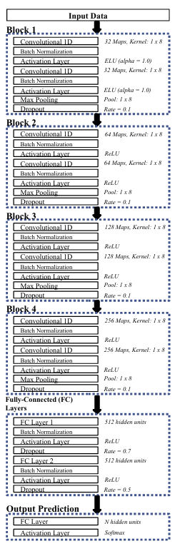

# Team-Info

| 항목 | 내용 |
|:--|:--|
| **과제명** | Elastic Weight Consolidation 기반 Continual Learning을 활용한 Deep Fingerprinting 성능 개선 |
| **팀 번호 / 팀 이름** | 11-nAIvis |
| **팀 구성원** | 배주원 (2271031): 리더, 전체적인 실험 및 논문작성 실행을 주도하며, 주요 사항을 최종 결정한다.   신유진 (2271034): 팀원, 연구 및 실험을 진행하며 특히 보고서, 회의록 등 진행과정 기록을 주도한다.   이서연 (2276217): 팀원, 연구 및 실험을 진행하며 특히 그래프, 표 등 결과 자료 제작을 주도한다. |
| **팀 지도교수** | 오세은 교수님 |
| **과제 분류** | 연구 과제 |
| **과제 키워드** | Catastrophic Forgetting, Continual Learning, Deep Fingerprinting |
| **과제 내용 요약** | Tor 네트워크 환경에서 Deep Fingerprinting(DF) 모델의 Catastrophic Forgetting 문제를 해결하고자, Elastic Weight Consolidation(EWC) 기반의 Continual Learning 기법을 적용한 새로운 DF 학습 프레임워크를 제안함. 다양한 Task 환경에서의 정확도 유지와 학습 효율성을 높이며, 실사용 가능한 보안 모델 개발을 목표로 함. |

# Project-Summary

| 항목 | 내용 |
|:--|:--|
| **문제 정의** | 기존 Deep Fingerprinting 모델은 정적인 데이터셋 기반으로 학습되어 시간에 따른 네트워크 트래픽 변화에 취약함. 이로 인해 새로운 Task 학습 시 기존 지식을 상실하는 Catastrophic Forgetting이 발생하며, 이는 실사용 환경에서 큰 성능 저하로 이어짐. |
| **기존 연구와의 비교** | 기존 연구들은 대부분 완전한 재학습 기반 혹은 정적 모델 구조를 사용함. 본 과제는 Elastic Weight Consolidation을 통해 지속적인 학습이 가능하며, 학습 비용을 줄이고 기존 Task 성능을 유지하는 장점을 가짐. |
| **제안 내용** | - 1D-CNN 기반 DF 모델에 EWC 적용 - Fisher Information을 기반으로 각 파라미터의 중요도를 계산 - 중요한 파라미터 변경을 억제하는 규제항 추가 - Closed-world / Open-world 환경 모두에서 실험 진행 |
| **기대효과 및 의의** | - 보안 분야에서 Continual Learning 적용 사례 제시 - 실제 Tor 환경에서도 학습 효율과 정확도를 동시에 확보 - Catastrophic Forgetting을 줄이는 데 성공한다면 향후 다양한 보안 시스템에 적용 가능성 확보 - 실시간 대응 가능성 증대로 학술적·산업적 기여 기대 |
| **주요 기능 리스트** | - Tor 트래픽 수집 및 전처리 자동화 - 1D-CNN 기반 DF 모델 구조 구현 - EWC 알고리즘 통합 및 FIM 계산 - Task 분할 및 실험 자동화 스크립트 - 정확도 및 망각 현상 분석 도구 - 결과 시각화 및 성능 리포팅 시스템 |

# Project-Design & Implementation

| 항목 | 내용 |
|:--|:--|
| **요구사항 정의** | - 기존 Deep Fingerprinting(DF) 모델이 시간에 따라 발생하는 트래픽 패턴의 변화에 민감하여, 새로운 Task를 학습할수록 기존 Task의 지식을 잃는 Catastrophic Forgetting 문제가 존재함 - 이를 해결하기 위해 Elastic Weight Consolidation(EWC)을 기반으로 한 Continual Learning 프레임워크를 도입하여, 과거 학습 정보의 보존과 새로운 정보의 학습을 동시에 가능하게 해야 함 - Closed-world(95개 클래스) 및 Open-world(50+45 Task) 환경 모두에서 학습이 가능해야 하며, 반복 실험을 통한 정량적 성능 분석과 결과 시각화까지 포함된 실험 자동화 구조가 요구됨 |
| **전체 시스템 구성** |- 데이터 처리 모듈: datasets/ 디렉토리에는 Tor 트래픽 기반의 패킷 방향 시퀀스가 클래스별로 저장되어 있으며, 각 Task에 맞게 데이터를 불러와 학습용/평가용으로 분할함. 데이터는 NumPy 형식으로 전처리되며, 시퀀스의 길이는 10,000으로 고정됨. main.py에서 Task 순서에 따라 데이터셋을 자동으로 불러오고, 배치 크기 및 셔플 여부 등 학습 설정에 맞춰 전달함.  - 모델 정의 모듈: Model.py에는 Tor 트래픽의 패킷 방향 시퀀스를 입력으로 받아 웹사이트를 분류하는 1D-CNN 기반 DFNet 모델이 정의되어 있음. 이 모델은 5개의 Conv 블록으로 구성되며, 각 블록은 Conv1D → BatchNorm → ReLU/ELU → MaxPooling → Dropout 순으로 설계됨. 필터 수는 32~512로 점진적으로 증가하고, 커널 크기는 8로 고정되어 시계열의 지역 패턴을 효과적으로 추출함. 이후 Flatten()을 통해 출력을 1차원으로 변환하고, 두 개의 Dense 층(512 유닛)을 거쳐 Softmax로 최종 분류를 수행함. 전반적으로 과적합 방지를 위한 Dropout과 BatchNorm을 활용해 일반화 성능을 높인 구조임.  - EWC 적용 모듈ewc.py에서는 이전 Task 학습 완료 후, 모델 출력에 대한 그래디언트를 기반으로 각 파라미터의 Fisher Information을 근사 계산함. 선택된 학습 샘플에서 로그 가능도에 대한 기울기를 제곱하여 평균냄으로써 파라미터의 중요도를 추정하고, 이를 FIM으로 저장함. 이후 학습에서는 ewc_loss() 함수가 기존 CrossEntropy 손실에 EWC 정규화 항을 더하는 형태로 사용됨. 이 정규화 항은 각 파라미터의 변화량에 해당 파라미터의 중요도(Fisher 값)를 곱해 계산되며, Catastrophic Forgetting을 방지함. 전체 로직은 학습 루프 내에서 자동으로 호출되어 지속 학습을 지원함.  - 학습 및 평가 모듈: train.py에서는 주어진 데이터를 기반으로 Task 단위의 학습 루프를 수행함. 첫 Task는 CrossEntropy 손실 함수를 사용하여 기본 학습을 진행하고, 이후 Task부터는 EWC 손실 함수가 적용되어 이전 Task 지식의 보존을 유도함. 각 Task 학습 후에는 현재 Task에 대한 정확도와 함께, 이전 Task에 대한 정확도도 재평가하여 망각 지표(F)를 계산함. 학습에는 Adam Optimizer를 사용하며, 에폭 수, λ 값, 샘플 수 등의 하이퍼파라미터는 main.py에서 인자로 전달받아 유동적으로 설정됨.|
| **주요 엔진 및 기능 설계** | - 1D-CNN 기반 DF 모델: 입력으로 주어지는 Tor 트래픽의 방향 시퀀스 데이터(길이 10,000)는 Conv1D 계층을 통해 처리되며, 총 5개의 Convolutional 블록으로 구성됨. 각 블록은 Conv1D → BatchNormalization → Activation(ReLU 또는 ELU) 순으로 구성되고, 이어서 MaxPooling1D와 Dropout 계층이 적용되어 과적합을 방지함. 필터 수는 블록마다 32, 64, 128, 256, 512로 증가하며, 커널 크기는 모두 8로 고정되어 시퀀스의 지역적 패턴을 추출하는 데 최적화되어 있음. 이후 Flatten()을 통해 feature map을 1차원 벡터로 변환한 뒤, 두 개의 Fully Connected(Dense) 계층을 거쳐 마지막 Softmax 계층에서 웹사이트 클래스 확률을 출력함. 각 FC 계층은 512개의 유닛을 가지며, Batch Normalization과 Dropout이 추가되어 학습 안정성과 일반화 성능을 강화함. 전체 모델은 Tor 트래픽의 시계열 특성과 위치 정보를 효과적으로 포착할 수 있도록 설계되었으며, Deep Fingerprinting 환경에 최적화된 구조를 따름.  -EWC 손실 함수: 기존 손실 함수에 다음과 같은 규제 항을 추가하여 Catastrophic Forgetting 완화   $L_{\text{total}} = L_{\text{task}} + \lambda \sum_i F_i (\theta_i - \theta_i^*)^2$  - FIM 계산:  Fisher Information Matrix(FIM)는 각 파라미터가 현재 Task의 예측 성능에 얼마나 기여하는지를 정량적으로 나타내는 지표로, Catastrophic Forgetting을 방지하는 핵심 요소로 사용됨. 본 프로젝트에서는 각 파라미터에 대한 손실 함수의 기울기(gradient)를 제곱하여 평균을 내는 방식으로 FIM을 근사함. 구체적으로는 선택된 학습 샘플들에 대해 로그 가능도(log-likelihood)의 그래디언트를 계산하고, 그 제곱값을 누적하여 평균냄으로써 각 파라미터별 중요도를 추정함. FIM 값이 클수록 해당 파라미터는 현재 Task에서 중요한 역할을 하며, 이후 Task 학습 시 손실 함수 내의 규제 항에서 더 큰 패널티가 부여되어 변화가 억제됨. 이러한 방식은 이전 Task에서 학습한 중요한 정보를 보존하면서도 새로운 Task에 대한 적응을 허용하여, 학습된 지식의 유지와 업데이트 간의 균형을 효과적으로 조절할 수 있게 함.|
| **주요 기능의 구현** |- Task 기반 학습 구조: 본 프로젝트는 95개의 Tor 웹사이트를 두 Task로 분할한 Closed-world 시나리오에 따라 실험을 수행함. main.py에서 Task 단위로 데이터를 분할하고, 각 Task에 대해 순차적으로 학습을 수행함으로써 모델이 점진적으로 새로운 클래스를 학습할 수 있도록 구성함. 각 Task 학습 시에는 train.py 내 학습 루프를 호출하여 독립적인 모델 업데이트가 이루어짐.  - 점진적 학습 전략 적용: 첫 번째 Task 학습 시에는 70 epoch을 적용하여 초기 정보 학습을 충분히 수행하고, 두 번째 Task에서는 20 epoch으로 설정하여 빠른 적응이 가능하도록 구성함. 이 설정은 초기 학습 안정성과 새로운 정보 반영의 균형을 고려한 전략임.  - EWC 기반 지속 학습 구현: ewc.py를 통해 Fisher Information Matrix(FIM)를 계산한 후, 이전 Task에서 중요한 파라미터 변화에 패널티를 부과하는 손실 함수를 정의함. 이를 통해 기존 Task의 성능을 유지하면서 새로운 Task를 학습함.  - 실험 종류 및 설정: ① Baseline 비교 실험: EWC 없이 순차적으로 학습하는 Non-Baseline, 모든 데이터를 한 번에 학습하는 Joint Learning, 그리고 EWC 기반 학습 성능을 비교함. ② 클래스 비율 변화 실험: Task 1과 Task 2에 할당되는 클래스 수를 90:5, 70:25, 50:45로 조정하여 클래스 비중이 Catastrophic Forgetting 완화에 미치는 영향을 실험함. ③ 람다(λ) 값 변화 실험: 정규화 계수 λ 값을 1, 5, 100, 1000으로 변경하여 EWC 손실 항의 영향력을 조정하고, 기존 정보 보존과 새로운 학습 간의 trade-off를 분석함. ④ 에폭 비율 변화 실험: Task 1과 Task 2의 epoch 비율을 20:20, 50:20, 100:20 등으로 달리하여 학습량의 차이가 망각 현상에 어떤 영향을 주는지 평가함.  - 성능 평가 방식: 각 Task 학습이 완료된 후, Task 1과 Task 2 데이터셋 모두에 대해 평가를 수행하며, 다음의 지표를 기준으로 실험 결과를 비교함: ∙ Task별 정확도 (T1, T2 Accuracy) ∙ 평균 정확도 (Average Accuracy)|
| **기타** | - 학습 환경: TensorFlow 기반으로 Google Colab 또는 로컬 GPU 환경에서 실험 수행 - 재현성 확보: 모든 실험에는 동일한 random seed를 고정하여 일관된 결과를 생성함 - 코드 관리 및 협업: GitHub 저장소(hineugene/continual-learning-DF)를 통해 코드 버전 관리 및 협업을 지원하며, 각 파일에는 명확한 주석과 디렉토리 구조 설명이 포함되어 있음 |
